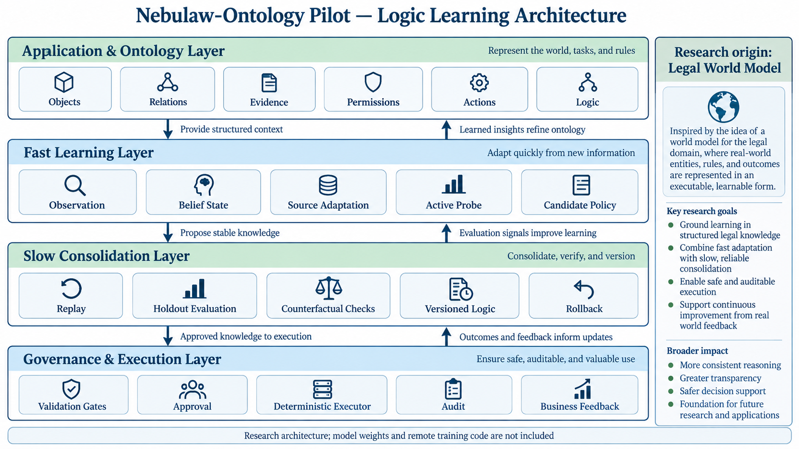
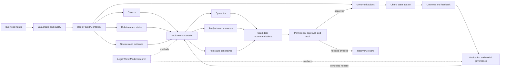
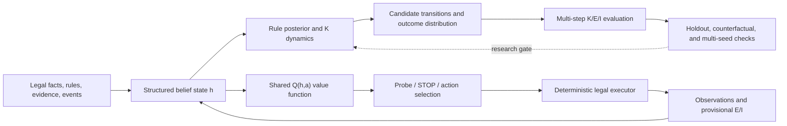

# Nebulaw-Ontology Pilot

**Let enterprise Logic learn.**

A research platform for continuous Logic learning. We study how Logic can adapt quickly to new feedback while preserving validated rules. Open Foundry provides the object, relationship, permission, and governance substrate; it is not our primary innovation.

> This is a research project and reference implementation. It is not an official Palantir project or a production-ready platform.

## Why this matters

The hardest thing for an enterprise to maintain is rarely another field or screen. It is the Logic distributed across rules, exceptions, evidence, approvals, and workflows.

As enterprise AI moves into real operations, FDEs (Forward Deployed Engineers) are increasingly important and expensive. Our goal is to reduce repetitive Logic maintenance, impact analysis, and regression work without removing expert accountability.

## Core idea: Logic learns at two speeds

New feedback enters a fast learning layer that updates current beliefs and candidate policies without rewriting stable Logic. After evaluation, replay, holdout, counterfactual, and governance checks, transferable changes enter a slow consolidation layer as a versioned Logic update with rollback.

Fast learning optimizes adaptation speed. Slow consolidation optimizes stability, transferability, and explainability.

## Logic learning loop

1. **Observe** — preserve source, time, and visibility; an observation is not automatically a fact.
2. **Hypothesize** — retain multiple possible rule or mechanism explanations in a belief state.
3. **Intervene** — choose the most informative verification or business action under cost, permission, and risk constraints.
4. **Validate** — promote a candidate only after type, permission, procedure, conflict, replay, and counterfactual checks.

Observation → Belief → Active intervention → Validation → Logic version

We distinguish the world state W, the belief state B, and the formal ontology Ω. A model may propose ΔΩ; it may not directly rewrite Ω.

## Research origin: the Legal World Model

We are a legal AI application company. We originally asked whether a large language model could have a Legal World Model as an experimental environment: a place where it could observe cases, evidence, and rules, take constrained actions, receive outcome feedback, and be tested on whether it actually updates its understanding.

That experiment has not yet succeeded. We do not claim to have built generally autonomous legal intelligence.

The unexpected result was architectural: the highest-cost part of ontology maintenance is often Logic, not objects or fields. The research suggested separating fast adaptation from slow consolidation and using replay, holdouts, counterfactuals, and governance to decide what becomes stable Logic.

### What problem does a Legal World Model solve?

Legal reasoning is not static question answering. Facts may not yet be observed, records may be wrong, new evidence may change an assessment, and procedure and permission constrain action. An action can also change what becomes observable next.

A Legal World Model is a controllable research environment. The model sees only information available at that time, proposes a constrained judgment or action, receives new observations and outcomes, and is evaluated on whether its beliefs and decisions change appropriately.

For example, a record saying “contract performance is overdue” is not automatically a fact. Performance may have occurred on time but been registered late; the deadline may have changed; or the evidence may be insufficient. The system should preserve these explanations, choose the next verification with the highest expected value, and then decide whether the change is temporary adaptation or a reusable Logic candidate.

### Semantic layers

| Layer | Question |
| --- | --- |
| K / I — norms and institutions | Which rules apply, and what permissions and procedures allow action? |
| E — evidence assessment | Which claims are supported, and under what proof requirements? |
| R / H — reality and observation | What happened, and what incomplete or noisy records were observed? |
| C / L — time and history | When did events, effects, knowledge, and decisions occur? |

What happened, what was proved, and what institutional effect followed must remain distinct.

## Architecture

The diagram summarizes the public research architecture: ontology and application semantics feed fast adaptation; validated changes move through slow consolidation; governed execution produces feedback for the next learning cycle.

The computation layer proposes; the ontology action layer validates and writes. This keeps facts, predictions, permissions, and feedback separate.

The current services/dynamics component is a lightweight mechanism implementation using a small CoefficientNetwork, an explicit Bayes observation kernel, and fixed dynamic programming. It is not the complete research model.

### Research model architecture (not included)

The structured belief-state, rule-posterior, K-dynamics, shared Q(h,a), probe/STOP selection, deterministic executor, and multi-step K/E/I evaluation route remains a research direction. Its code, data, adapters, checkpoints, and weights are not included in this repository or used as runtime dependencies.

The research route is not “feed legal text into a Transformer and generate an answer.” It learns rule posteriors, dynamics, and value over structured belief states. The deterministic executor validates legal actions, materializes state changes, and computes strict metrics. Fixed planners and executors must not be counted as capabilities learned by the model.

## Concrete example

Suppose a contract rule recommends collection when an overdue event is evidenced and the responsible party is clear. New cases introduce incomplete evidence or a changed responsible party.

- **Fast learning** updates the current belief, evidence weights, and candidate actions without rewriting stable Logic.
- **Slow consolidation** uses later outcomes, replay, counterfactuals, and holdouts to decide whether the new condition deserves a versioned Logic update.

New situation → Temporary adaptation → Feedback → Logic candidate → Counterexample checks → Stable version

## Research evidence and comparisons

The Legal World Model work produced useful evidence, but only under explicitly limited conditions. In controlled micro-worlds, we observed that structured rule recovery could reproduce held-out combinations, and that actively choosing the next verification could reduce decision loss compared with fixed or short-sighted strategies. These experiments also showed why a high score is not enough: some gains disappeared under relation shuffling, changed surface expressions, external tests, or longer multi-step rollouts; fixed executors and planners could account for a substantial part of apparent performance. The resulting lesson was to separate model learning from deterministic execution, report negative results, and count the cost of information and action.

The current project tests the engineering form of that lesson. In a source-aware candidate experiment, a new feedback stream improved performance under several controlled distribution shifts compared with a pooled baseline, while the same update could reduce accuracy on the old environment. This is evidence for separating fast adaptation from slow consolidation—not evidence that forgetting has been solved. The current repository also contains a lightweight Dynamics implementation for mechanism validation; it is not the full Legal World Model, and it should not be compared with a general-purpose language model as if they solved the same task.

In short, the comparison is not “our model is universally better.” It is a research comparison between different learning and governance choices: fixed versus adaptive Logic, pooled versus source-aware feedback, and immediate updates versus evaluated consolidation. The numbers are useful for reproducing the mechanism and its limits; real customer impact still requires authorized data, a business baseline, and an end-to-end pilot.

## Repository

| Directory | Purpose |
| --- | --- |
| platform/ | Open Foundry platform and domain packs |
| services/ | Dynamics and Plus Engine components |
| ops/ | Selected local learning, evaluation, and audit tools |
| docs/ | Quickstart, boundaries, code map, and licensing |

## Quickstart

Requirements: Node.js 24+

    npm run test:smoke

The smoke suite requires no remote service, credentials, model download, or model weights. It is not full platform acceptance. One optional source-specific fitting test is explicitly skipped unless its build environment is configured.

## Boundaries

- General Legal World Model capability and autonomous rule discovery are not complete.
- Production reliability, cross-industry transfer, and large-scale deployment are not validated.
- Research evidence is primarily controlled or synthetic.
- Model weights, private deployment configuration, and internal runtime materials are excluded.
- Root-level additions, data, research assets, and third-party components require separate licensing review.

## Licensing and security

platform/ retains its upstream Apache-2.0 license. This does not automatically license root-level additions, research weights, datasets, or third-party assets. See [LICENSING.md](docs/LICENSING.md). Do not submit credentials, private keys, customer data, or internal infrastructure details.

## Contact

We hope this architecture can reduce FDE implementation and maintenance cost. For discussion of Logic learning, Legal World Models, ontology engineering, or governed continuous learning:

**yangjiakang@nebulaw.ai**

## Status

Suitable for research discussion, controlled demos, and architecture experiments. Not suitable as a production system or legal conclusion generator.
